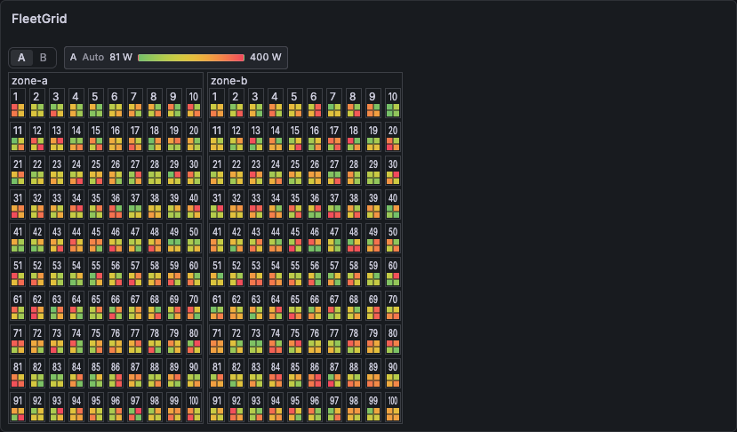

# FleetGrid

A Grafana panel plugin that renders nested physical topologies — such as zones, hosts, and GPUs — as a hierarchical grid, and colors each cell by a Prometheus / VictoriaMetrics metric. It is designed for a bird's-eye view of large AI / HPC clusters, where hundreds of nodes and thousands of cells need to be scanned at a glance.

The panel draws every cell on a single `<canvas>` and overlays the tooltip, drilldown popover, legend, and metric selector as React DOM. Keeping the cells off the DOM is a deliberate design choice: the number of DOM nodes stays constant regardless of cell count, which avoids the per-cell React re-render and browser layout cost that a DOM-based grid would incur at the design target of a few thousand cells (up to ~15,000 sub-regions in split mode).



The example shows two zones and 200 nodes (100 per zone), with four GPU cells per node in a nested zone → host → GPU topology. Each cell is colored by the selected metric and the effective range is shown in the header.

## Features

- **Hierarchical grid** — Define an arbitrary number of nesting levels from your query labels (e.g. `zone` → `host` → `gpu`). Each level chooses its own layout (stack, row, flow-wrap, or grid) and sort order.
- **Grafana-native display with label-based ranges** — Unit, Decimals, value mappings, color scheme, Thresholds, and Data Links continue to use Grafana's **Field** and **Overrides** tabs. FleetGrid adds ordered label matchers only for choosing a cell's Min/Max; it does not add a threshold DSL.
- **Always-visible range legend** — The panel header shows a fixed gradient for a metric that uses one range. When cells use several ranges it says `Label-based ranges` instead of implying one fixed scale; hover shows the range that was actually applied.
- **Auto-fitted cells** — Cell size is computed from the panel dimensions. Numbers are drawn only when the formatted text fits; the exact value is always available on hover.
- **Natural sort** — Numeric segments inside labels are compared as numbers (`node-a2 < node-a10`), ascending by default (descending and "data order" are also selectable).
- **Multiple metrics** — Show one metric at a time with an in-panel selector (default), or opt in to split each cell into sub-regions to compare its metrics side by side. The tooltip and popover list every metric that returned data.
- **Drilldown** — Click a cell to open a popover with the current value per metric, plus a sparkline whenever time-series data is available for that metric. If the field has Data Links, navigation takes priority over the popover.

## Compatibility

| Requirement | Value                          |
| ----------- | ------------------------------ |
| Grafana     | `>= 11.6.0`                    |
| Data source | Prometheus / VictoriaMetrics   |
| Query type  | Instant (recommended) or Range |

Coloring, units, and drilldown rely on Grafana's standard field config, so any data source that produces labeled numeric series can work, but the plugin is designed for Prometheus / VictoriaMetrics. The automated end-to-end tests run against Grafana's built-in TestData data source; verification against a live Prometheus / VictoriaMetrics instance — including the instant-query drilldown re-query — is still outstanding and recommended before production use.

## Quick start

### 1. Add queries

Add one or more numeric queries. Instant queries are recommended because the panel only needs the current value, which minimizes transfer. A range query is folded to a single current value per series (see [Reduce calculation](#data)).

```promql
# Query A — one series per (zone, host, gpu)
max by (zone, host, gpu) (gpu_power_watts)

# Query B — a second metric over the same topology
max by (zone, host, gpu) (gpu_temperature_celsius)
```

Every cell is built from the **union** of all queries, so a node present in only one query still appears in the grid; cells with no sample for the displayed query are painted with the missing color.

### 2. Configure hierarchy levels

Open the panel editor and add hierarchy levels under **Hierarchy**. The editor lists the label keys found in your query results and, for each level, shows the detected group count and sample values so misconfiguration is visible immediately.

| Level | Label  | Extract         | Layout             |
| ----- | ------ | --------------- | ------------------ |
| 1     | `zone` | As is           | Grid (columns: 2)  |
| 2     | `host` | Trailing number | Grid (columns: 10) |
| 3     | `gpu`  | As is           | Grid (columns: 2)  |

This `2 / 10 / 2` configuration reproduces a two-column top level, ten hosts per row within each top-level group, and two GPUs per row within each host. Levels are reorderable and there is no fixed depth limit (about 8 levels is a practical maximum).

### 3. Choose a color scheme

On the **Field** tab, set a **Color scheme** such as `Green-Yellow-Red (by value)` for a continuous gradient, or configure **Thresholds** for discrete colors. Set **Unit**, **Decimals**, and **Min/Max** as needed. Per-query settings (for example a different unit for temperature) go through **Overrides → Fields with name matching a query (by refId)**.

Each query's color scale is independent: a query with no explicit Min/Max is auto-scaled to its own data range, so a power metric (600–1000 W) and a temperature metric (30–90 °C) are not flattened onto one shared scale. The always-visible header legend formats its endpoints with the configured Unit and Decimals. It labels the range `Fixed`, `Auto`, `Min fixed`, or `Max fixed` according to which endpoints are explicitly configured.

When one query needs different limits by zone or pod, add rules under **Color scale overrides**. Rules are evaluated from top to bottom; the first rule whose optional refId and label conditions all match wins. Both table frames (string columns are labels) and time-series frames (`field.labels`) are supported.

## Options reference

### Hierarchy

Configured through the **Hierarchy levels** editor. Each level has:

| Setting      | Values                                       | Notes                                                                                                                                                                  |
| ------------ | -------------------------------------------- | ---------------------------------------------------------------------------------------------------------------------------------------------------------------------- |
| Label        | any detected label key                       | The label to group by at this level                                                                                                                                    |
| Extract      | `As is` / `Trailing number` / `Custom regex` | How to derive the level key from the label value. `Trailing number` turns `node-a004` into `004`; `Custom regex` uses the first capture group (e.g. `node-.+(\d\d\d)`) |
| Sort         | `Natural (asc)` / `Natural (desc)` / `None`  | `None` keeps data appearance order                                                                                                                                     |
| Layout       | `Stack` / `Row` / `Flow` / `Grid`            | Grid requires a column count                                                                                                                                           |
| Grid columns | number                                       | Only for the grid layout                                                                                                                                               |
| Border       | on / off                                     | Draw a border around each group                                                                                                                                        |
| Group label  | on / off                                     | Show the group label                                                                                                                                                   |

### Display

| Option                 | Default         | Description                                                                                     |
| ---------------------- | --------------- | ----------------------------------------------------------------------------------------------- |
| Display mode           | `Single`        | `Single` shows one metric with a selector; `Split` divides each cell into per-query sub-regions |
| Default metric (refId) | first query     | Which query the selector starts on in single mode                                               |
| Show values            | on              | Draw numbers when they fit; hover still shows the value when off or when text does not fit      |
| Extra tooltip labels   | empty           | Label names whose distinct values are listed in the cell tooltip, for example `partition`       |
| Missing color          | `rgb(70,70,70)` | Fill for cells with no sample for the displayed query                                           |

### Categorical decoration

Categorical decoration assigns a deterministic color to each distinct value of a selected label and draws that color on top of the metric fill. The **Border** style outlines each cell; **Top bar** uses a compact strip at the top of each cell and is useful when cells are small. Border is recommended in split mode because it remains visible around the metric sub-regions. The accompanying legend maps each color to its value and can be hidden independently.

Colors are deterministic for the current sorted value set, but are not pinned across value-set changes: adding a new value that sorts earlier can shift later colors. Cells without the selected label value receive no categorical decoration. For Slurm, set `categoryLabel` to `partition` for the `slurm_node_status` query from [SckyzO/slurm_exporter](https://github.com/SckyzO/slurm_exporter); choose `border` or `topBar` with `categoryStyle` as appropriate.

Click legend values to highlight matching cells; selections toggle and can be combined, with multi-value cells matching when any value is selected. Use **Clear** to remove the selection. Dimmed cells remain hoverable and clickable, and this view-only selection is not saved to the dashboard.

| Option               | Default  | Description                                                                 |
| -------------------- | -------- | --------------------------------------------------------------------------- |
| Category label       | empty    | Label whose values drive categorical cell colors; empty disables decoration |
| Category style       | `Border` | `Border` or `Top bar` decoration style                                      |
| Show category legend | on       | Show the categorical color/value legend in the panel header                 |

### Data

| Option              | Default           | Description                                                                                                                                      |
| ------------------- | ----------------- | ------------------------------------------------------------------------------------------------------------------------------------------------ |
| Spatial aggregation | `Max`             | Combines multiple series that fall on the same cell (e.g. when the hierarchy stops above the series granularity). `Max` / `Mean` / `Min` / `Sum` |
| Reduce calculation  | `Last (not null)` | Folds a range query into one current value per series. Limited to reducers that return a number                                                  |

### Color scale overrides

Each rule has an optional **refId** (blank means every metric), one or more label conditions, and at least one of **Min** or **Max**. Conditions within a rule are ANDed. `exact` compares the whole label value; `regex` uses JavaScript `RegExp` search semantics, so add `^` and `$` when a full-string match is required. The editor lists refIds, detected label names, and sample values, and supports adding, deleting, and reordering rules.

Rules are ordered and first-match-wins. An omitted endpoint falls back first to that metric's standard field-config endpoint and then to FleetGrid's existing automatic range. This makes min-only and max-only rules useful. Invalid regexes, rules without a range endpoint, and `min >= max` are reported in the editor and are not applied.

The following panel-options fragment gives GPU power query `A` a zone-specific maximum and bandwidth query `B` a maximum selected by both zone and bandwidth type:

```json
{
  "rangeOverrides": [
    {
      "refId": "A",
      "matchers": [{ "label": "zone", "operator": "exact", "value": "isk-sec-c" }],
      "min": 0,
      "max": 700
    },
    {
      "refId": "A",
      "matchers": [{ "label": "zone", "operator": "exact", "value": "isk-sec-d" }],
      "min": 0,
      "max": 650
    },
    {
      "refId": "B",
      "matchers": [
        { "label": "zone", "operator": "exact", "value": "isk-sec-c" },
        { "label": "bw_type", "operator": "regex", "value": "^NVLink " }
      ],
      "min": 0,
      "max": 900
    },
    {
      "refId": "B",
      "matchers": [
        { "label": "zone", "operator": "exact", "value": "isk-sec-c" },
        { "label": "bw_type", "operator": "regex", "value": "^(PCIe|NIC|Lustre|SONiC) " }
      ],
      "min": 0,
      "max": 400
    }
  ]
}
```

Add more ordered rules when another zone, pod, or bandwidth class needs a different maximum. Metrics such as GPU temperature, ECN marked packets, and PFC pause frames should have no matching rule when they need automatic scaling.

If a hierarchy extraction regex collapses several source label sets into one cell, all contributing labels must resolve to the same rule. A mix of rules, or of matched and unmatched labels, produces a warning and uses the standard field-config/automatic range for that cell; FleetGrid never chooses according to input order. Leaving `rangeOverrides` empty preserves the previous behavior exactly.

## Multiple metrics

The cell model holds each query's value for a cell (marked missing where a query returned no series); only the drawing mode changes.

- **Single mode (default)** — Each cell is filled with the color of the selected metric. The header always shows the selected metric's range legend, including when the panel has only one query. With multiple queries, a selector to the left of the legend switches metrics with one click and the legend follows the selection. At widths of 480 px or more, a metric with one effective range shows its name, range state, formatted endpoints, and a horizontal color scale sampled from the same color processor as the cells. Below 480 px, it becomes a compact state icon and `min–max` badge. A metric using several effective ranges instead shows `Label-based ranges` and the range count. The selector lists every query, including one that returned no series (shown by its refId); selecting that query paints every cell with the missing color and keeps a `No data` legend visible without inventing range values. The selection is viewer-local state and is not saved as a dashboard change; the initial metric is the **Default metric** option (or the first query).
- **Split mode (opt-in)** — Each cell is auto-divided by the number of metrics that returned data: 2 = left/right, 3 = three columns, 4 = 2×2, 5–6 = 3×2, 7–9 = 3×3. Regions are capped at 9; with 10+ metrics only the first 9 are drawn and the legend notes the remainder. The header legend combines each region's position minimap with its metric name and either its single formatted range or `Label-based ranges`; entries wrap when space is limited. A query that returned no series gets no region. Values are not drawn inside split regions because they are inherently too small to read.

The tooltip (on hover) and the drilldown popover list every metric that returned data, regardless of mode. The tooltip also shows the hovered cell's actual formatted Min/Max, its `Fixed` / `Auto` / `Min fixed` / `Max fixed` state, and the matched label conditions or standard-range fallback.

For Slurm dashboards, `slurm_node_status` from [SckyzO/slurm_exporter](https://github.com/SckyzO/slurm_exporter) exposes a `partition` label per node; add `partition` to `tooltipLabels` to show it in the cell tooltip.

## Drilldown

Clicking a cell resolves in this order:

1. **Data Links** — If the field has Grafana Data Links configured, the click navigates. A single link is followed immediately; multiple links open a small link-selection menu the panel renders itself. Data Links always take priority.
2. **Popover** — Otherwise a card-style popover opens next to the cell, showing the hierarchy path and, per metric, the current value plus a sparkline when time-series data is available (see the instant-query note below); metrics without a time series show "No time series" instead. It auto-flips and clamps to stay inside the visible area and closes on outside-click or `Esc`.

**Instant query note** — When **any** of the panel's queries is instant (no time series in the received frames), clicking re-runs **all** of the panel's queries as range over the dashboard time range via the data source — a query configured as `format: table` is re-issued as `time_series` to request a time series, though whether a matching series actually comes back depends on the query and data source — capped at ~100 data points, then extracts the series matching the clicked cell. The result is cached per panel, so opening additional cells does not trigger another fetch. A failed re-query shows a short message in the popover; that error state is cleared only when the panel's query `requestId` changes (for example on the next dashboard refresh), which is what allows a retry. When the panel already runs range queries, no re-query happens. If re-querying feels slow at your scale, switch to range queries to remove it entirely. This instant-query drilldown path has not yet been verified against a live Prometheus / VictoriaMetrics data source.

## Layout notes

Grid layouts fill groups in row-major order within each parent: with two columns, items `0` and `1` occupy the first row, followed by `2` and `3` on the next row. Configure each hierarchy level independently; for example, the Quick start's `2 / 10 / 2` column counts produce the fixed nested layout described above.

Cell size is auto-fitted between **6 px** and **40 px** by scanning candidate sizes from large to small and taking the largest that fits the panel. If even 6 px cells do not fit, the size is pinned to 6 px. The panel then scrolls **vertically** when the content is taller than the panel and **horizontally** when it is wider. While scrolling vertically, the current top-most level's group label stays pinned to the top — but only when that top level has its **Group label** enabled, since otherwise there is no label to pin.

## Deployment

The plugin is not yet published to the Grafana catalog and its release builds are unsigned, so it must be installed manually.

### 1. Get the build

- **From a GitHub Release** — download the `yuuk1-fleetgrid-panel-<version>.zip` asset attached to the release (built by `.github/workflows/release.yml` whenever a `v*` tag is pushed).
- **From source** — run `npm install && npm run build`; the output is written to `dist/`.

### 2. Install into Grafana

Copy (or extract) the build into Grafana's plugin directory as a folder named after the plugin ID:

```bash
cp -r dist "$GF_PATHS_PLUGINS/yuuk1-fleetgrid-panel"
```

Because the plugin is unsigned, Grafana refuses to load it unless it is explicitly allow-listed. Set the following on the Grafana server (or in `grafana.ini` under `[plugins]` as `allow_loading_unsigned_plugins`) before starting/restarting it:

```bash
GF_PLUGINS_ALLOW_LOADING_UNSIGNED_PLUGINS=yuuk1-fleetgrid-panel
```

### SSH deployment

To build locally and deploy `dist/` over SSH, run `scripts/deploy-plugin-ssh.sh` from the repository. `DEPLOY_HOST` is required; the other settings are optional:

```bash
DEPLOY_HOST=grafana.example.com \
DEPLOY_USER=deployer \
REMOTE_SUDO=1 \
RESTART_GRAFANA=1 \
scripts/deploy-plugin-ssh.sh
```

The script supports `DEPLOY_PORT`, `REMOTE_PLUGIN_DIR`, `PLUGIN_OWNER`, and `GRAFANA_SERVICE`. It does not configure Grafana's unsigned-plugin allow-list, so configure `GF_PLUGINS_ALLOW_LOADING_UNSIGNED_PLUGINS=yuuk1-fleetgrid-panel` on the remote Grafana host separately.

### 3. Docker / docker-compose example

```yaml
services:
  grafana:
    image: grafana/grafana:11.6.0
    ports:
      - '3000:3000'
    environment:
      - GF_PLUGINS_ALLOW_LOADING_UNSIGNED_PLUGINS=yuuk1-fleetgrid-panel
    volumes:
      - ./dist:/var/lib/grafana/plugins/yuuk1-fleetgrid-panel
```

### 4. Verify

Restart Grafana, then add a panel and confirm **FleetGrid** appears in the visualization picker. Check **Administration → Plugins** to confirm the plugin loaded without errors if it does not appear.

## Development

**Prerequisites:** Node.js `>= 22` (see `.nvmrc`) and Docker (for `npm run server` and the e2e Grafana instance). Before the first `npm run e2e`, install the Playwright browser once with `npx playwright install chromium`.

```bash
npm install

# Build in watch mode
npm run dev

# Production build
npm run build

# Type check and lint
npm run typecheck
npm run lint

# Unit tests (Jest)
npm run test:ci

# Run a local Grafana with the plugin (Docker)
npm run server

# Pin a Grafana version for the dev server / e2e
GRAFANA_VERSION=11.6.0 npm run server

# End-to-end tests (Playwright, @grafana/plugin-e2e) — needs a running server
npm run e2e
```

The build uses the webpack configuration provided in `.config/`. Data transformation (`src/data`), layout (`src/layout`), and hit testing (`src/render`) are pure functions verified directly with Jest; the canvas render layer is intentionally thin.

## Acknowledgements

FleetGrid was inspired by [HewlettPackard/hpe-grafana-clusterview-panel](https://github.com/HewlettPackard/hpe-grafana-clusterview-panel), whose approach to presenting cluster topology in Grafana helped inform this project's direction. FleetGrid builds on that inspiration with its own hierarchical, canvas-based rendering approach.

## License

Apache-2.0. See [LICENSE](./LICENSE).
